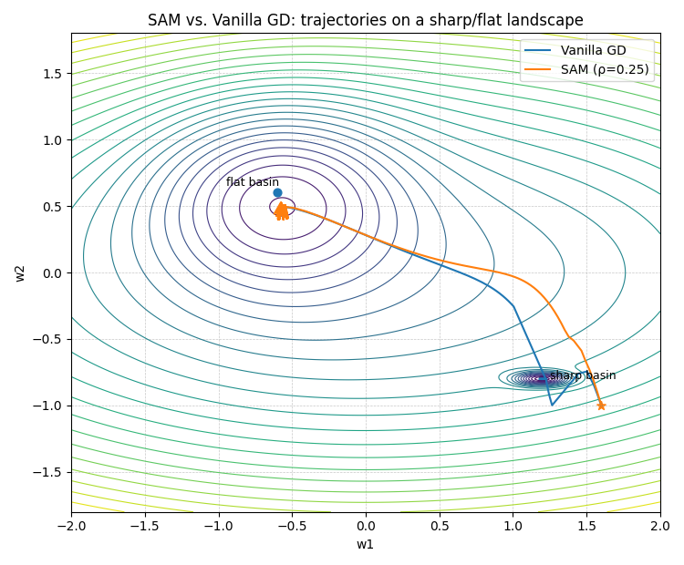
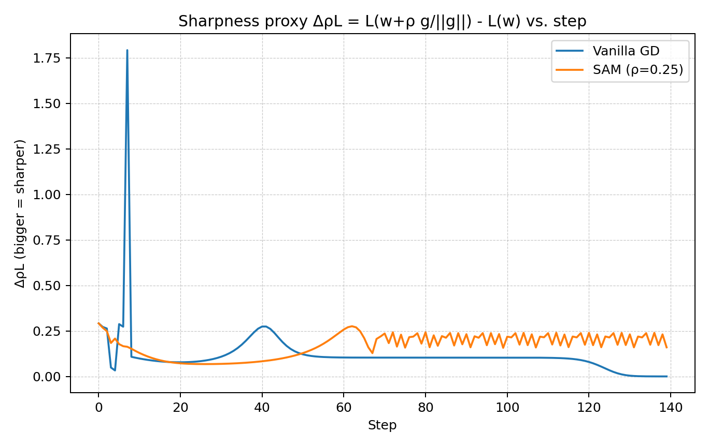

# SGDの改良
**Kenichiro Goto** / 2025-10-10  
教科書 p.45〜p49（第3.5章）

---

# 扱うテーマ
- 勾配降下法に基づく更新則を整理する
- 自動的に学習率を調整する代表的手法を理解する
- 近年の改良手法と SAM の位置づけを俯瞰する

---

# 基本式と勾配
- パラメータ更新の基本形  
  $$
  \mathbf{w}_{t+1} = \mathbf{w}_t - \varepsilon \nabla E_t 
  $$

- 更新量と勾配を定義  
  $$
  \Delta\mathbf{w}_t = \mathbf{w}_{t+1} - \mathbf{w}_t, \qquad
  \mathbf{g}_t = \nabla_{\mathbf{w}} E(\mathbf{w}_t)
  = \begin{pmatrix}
  \frac{\partial E}{\partial w_1} & \cdots & \frac{\partial E}{\partial w_d}
  \end{pmatrix}^{\!\top}
  $$

- 各成分の更新則  
  $$
  \Delta w_{t, i} = - \varepsilon g_{t, i}
  $$

---

# 学習率の選定
- SGD の収束速度と安定性は学習率 $\varepsilon$ に強く依存  
- 適切な $\varepsilon$ の設定を不要にするための「自動調整系」が多数提案  

---

# 自動調整系の代表例
- AdaGrad（以降の手法の基礎）  
- RMSProp / AdaDelta  
- Adam  
- RAdam（Rectified Adam）  
- AdamW  

---

# AdaGrad
- よく更新された成分には小さな学習率、あまり更新されなかった成分には大きな学習率を割り当てる  
- 更新則  
  $$
  \Delta w_{t, i} = - \frac{\epsilon}{\sqrt{\sum_{t'=1}^t g^{2}_{t', i} + \varepsilon}} g_{t, i}
  $$
- 累積項 $\sum_{t'=1}^t g^{2}_{t', i}$ が単調増加するため、更新が停止する傾向  
- $\varepsilon$ はゼロ除算を防ぐために加える微小項  
> ※ 本スライドでは $\epsilon$ を学習率、$\varepsilon$ を数値安定化(ゼロ除算回避)
> のための微小項として用いる。

---

# RMSProp
- 累積和の代わりに「指数移動平均」を使い、過度な減衰を防ぐ  
  $$
  \langle g_i^2 \rangle_t = \gamma \langle g_i^2\rangle_{t-1} + (1-\gamma) g^2_{t, i}
  $$
- 更新式  
  $$
  \Delta w_{t,i} = - \frac{\epsilon}{\sqrt{\langle g_i^2 \rangle _t + \varepsilon}}g_{t, i}
  $$
- $\gamma$ は通常 0.9 程度  
- 「過去をなだらかに忘れる」ことで適応性を確保  

---

# AdaDelta
- RMSProp に加え、過去の更新量の情報も用いる  
  $$
  \langle \Delta w_i^2 \rangle_t = \gamma\langle\Delta w_i^2 \rangle_{t-1} + (1-\gamma)(\Delta w_{t, i})^2
  $$
- 更新式  
  $$
  \Delta w_{t, i} = - \frac{\sqrt{\langle\Delta w_i^2 \rangle_{t-1} + \varepsilon}}{\sqrt{\langle g_i^2 \rangle_t + \varepsilon}}g_{t, i}
  $$

### 意図
- $\epsilon$ を単位合わせのため置き換え  
- $\langle \Delta w_t^2 \rangle$ は未知なので、$t-1$の値で近似  

---

# Adam：モーメント推定
- 一次・二次モーメントを指数移動平均で推定  
  $$
  m_{t, i} = \beta_1 m_{t-1, i} + (1-\beta_1) g_{t, i}, \qquad
  v_{t, i} = \beta_2 v_{t-1, i} + (1-\beta_2) g^2_{t, i}
  $$

- 初期段階の過小評価を補正  
  $$
  \hat{m}_{t, i} = \frac{m_{t, i}}{1 - \beta_1^t}, \qquad
  \hat{v}_{t, i} = \frac{v_{t, i}}{1 - \beta_2^t}
  $$

| 記号 | 意味 |
| :--: | :--: |
| $\hat{m}_{t,i}$  | 補正済みの平均勾配 |
| $\hat{v}_{t,i}$  | 補正済みの分散 |

---

# Adam：更新則と特徴
- 最終的な更新式  
  $$
  \Delta w_{t, i} = - \frac{\epsilon}{\sqrt{\hat{v}_{t, i}} + \varepsilon} \hat{m}_{t, i}
  $$
- 学習率の微調整をしなくても安定した学習が得やすい  
- 過去勾配の「方向」と「分散」を同時に考慮  

---
## 直感的な理解
$$
\Delta w_{t, i} = - \frac{\epsilon}{\sqrt{\hat{v}_{t, i}} + \varepsilon} \hat{m}_{t, i}
$$

- 分母の $\sqrt{\hat{v}_{t, i}}$ : 勾配がよくばらつくパラメータ → 更新を小さく
- 分子の $\hat{m}_{t, i}$ : 勾配が一貫して同じ方向を指している → 更新を大きく

<!-- ---
## モーメントの補足
- モーメントとは平均や分散などの分布の形を表す統計量のこと
Adamでは
- 一次モーメント:  勾配の「平均（方向）」
- 二次モーメント: 勾配の「分散」 -->

---
### モーメント補足(発表はしない)
#### 一次モーメント（平均）の展開

指数移動平均の再帰式
$$
m_t = \beta m_{t-1} + (1 - \beta) g_t
$$

これを展開すると

$$
\begin{aligned}
m_t 
&= (1 - \beta) g_t + \beta (1 - \beta) g_{t-1} + \beta^2 (1 - \beta) g_{t-2} + \cdots \\
&= (1 - \beta) \sum_{k=0}^{t-1} \beta^k g_{t-k}
&
\end{aligned}
$$

したがって、$m_t$ は過去の勾配の指数加重平均（滑らかな平均）を表す。

---

#### 二次モーメント（分散の近似）の展開(発表しない)

$$
v_t = \beta v_{t-1} + (1 - \beta) g_t^2
$$

展開すると

$$
\begin{aligned}
v_t 
&= (1 - \beta) g_t^2 + \beta (1 - \beta) g_{t-1}^2 + \beta^2 (1 - \beta) g_{t-2}^2 + \cdots \\
&= (1 - \beta) \sum_{k=0}^{t-1} \beta^k g_{t-k}^2
\end{aligned}
$$

したがって、$v_t$ は勾配の二乗の指数加重平均、すなわち $E[g^2]$ の近似となる。
本来分散は $Var[g]=E[g^2] - (E[g])^2$ だがここでは第2項は無視して「勾配の2乗の指数移動平均は分散の近似」と言い張っている

---

# Adam 系の改善案
- **AdaBound**：更新幅 $\frac{\epsilon}{\sqrt{\hat{v}_{t, i}}}$ が極端に振れるのを避けるために上下限を設ける  
- **RAdam**：学習初期(10step程度)にモーメント平均の不安定さを補正
- **Warm-up**：初期初期の一定期間のみ $\epsilon$ を小さくして安定化  
- **AdamW**：重み減衰を更新式に直接組み込む  
  $$
  \Delta w_{t, i} = - \frac{\epsilon}{\sqrt{\hat{v}_{t, i}} + \varepsilon} \hat{m}_{t, i} - \epsilon \lambda w_{t, i}
  $$
  - 重みの減衰(教科書式3.9)と同じ効果を狙って加えられる

---

# 学習率スケジューリング
- Adam でもスケジューラ併用で性能向上する場合あり  
- 手法例：  
  - コサイン減衰とか
- 自動調整とスケジューリングを組み合わせる設計が一般的  

---

# SAM（Sharpness-Aware Minimization）
- 平坦な極小点を探索し、汎化性能を高める(過学習を抑制)  
- 目的関数  
  $$
  \min_{\mathbf{w}} \max_{\lVert \boldsymbol{\epsilon} \rVert_p \le \rho}
  E(\mathbf{w} + \boldsymbol{\epsilon}) + \lambda \lVert \mathbf{w} \rVert_2^2
  $$
- $E$は交差エントロピーなど基本的な損失関数
---

 

---

- 縦軸はその点のflatnessの指標
- vanilla GDは一時的に鋭い点を通過するので値が大きくなる

---

---

### SAMの式理解
$$
  \min_{\mathbf{w}} \max_{\lVert \boldsymbol{\epsilon} \rVert_p \le \rho}
  E(\mathbf{w} + \boldsymbol{\epsilon}) + \lambda \lVert \mathbf{w} \rVert_2^2
\\
\mathbf{w}_{t+1} = \mathbf{w}_t - \epsilon \, \nabla E\!\left(\mathbf{w}_t + \hat{\boldsymbol{\epsilon}}\right)
$$

- $\mathbf{w}$: モデルの重みベクトル(次元＝全パラメータ数)
- $E(\mathbf{w})$: 損失関数
- $\epsilon$: 重み空間の微小摂動($\mathbf{w}$ と同じ次元)。
  - ️⚠️入力の摂動ではない
- $\lVert \epsilon \rVert_p \le \rho$: p-ノルム半径 $\rho$ 以内の小さな摂動だけ許す
- $\lambda \lVert \mathbf{w} \rVert_2^2$: 正則化(重み減衰)

---

読み方
- 二つの最適化問題の組み合わせ
- 内側の$\max$: 今の $\mathbf{w}$ から許された最悪の微小ズレで損失がどれだけ悪化するかを見る。
  - 損失関数を一番悪化させる摂動 $\epsilon$ を見つける
- $\min$: そのハンデを負った状態で損失関数を最小化する重み $\mathbf{w}$ を見つける

---
### なんで平らな極小値に行くの？（読まない）

もし谷が鋭いなら、ごく小さなズレでも損失が大きく増える。→ すると 
maxE(w+ϵ) が大きくなるから、その場所は悪いと判定され、更新で避けられる。
逆に平らな場所は少しずらしても損失がほとんど増えない → 最悪値も低い → そこへ吸い寄せられる。
結果として、ちょっとした重みの揺らぎに頑丈な解を選びやすくなる。

---
式で説明(読まない)
$$
\nabla_{\mathbf{w}} L_{\mathrm{SAM}}(\mathbf{w})
= \nabla E(\mathbf{w}) + \rho \, \frac{H(\mathbf{w}) \, \nabla E(\mathbf{w})}{\|\nabla E(\mathbf{w})\|}.
$$
- $H(𝑤)$ (ヘッセ行列)が鋭い谷ほど大きい（曲率が大）。
- そこでは第2項が大きくなる
- 結果的に 更新方向が通常の −∇E から少しズレる（勾配方向の先で曲率が大きい領域を避けるように傾く）(ベクトルの足し算)

---

# まとめ表

| 手法 | 仕組みの要点 | 特徴 |
|------|---------------|------|
| AdaGrad | 勾配の累積値で更新幅を調整 | 更新が止まりやすい |
| RMSProp | 累積の代わりに移動平均を使用 | 更新の減衰を防ぐ |
| AdaDelta | 更新量の平均も利用 | 単位を自然に整える |
| Adam | 一次・二次モーメントを推定 | 安定して学習しやすい |
| AdamW | 減衰項を直接加える | 重みの大きさを抑える |
| SAM | 平坦な極小点を探索 | 汎化性能の向上を狙う |

---

# まとめ
- 更新幅設計することでSGDの改善をするアイデアが多くある
- 自動調整系は過去勾配統計量で学習率を制御  
