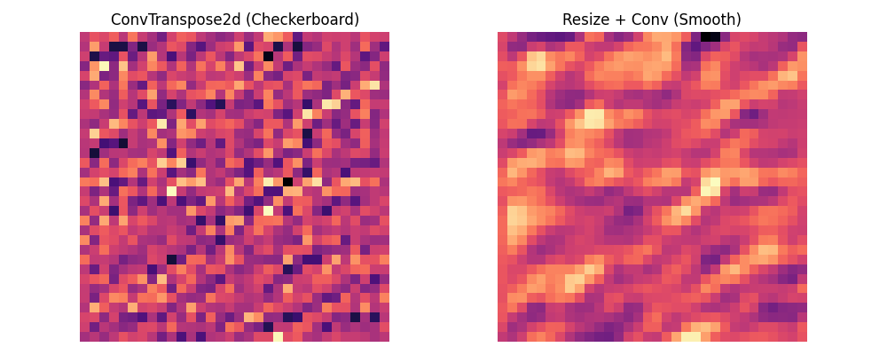
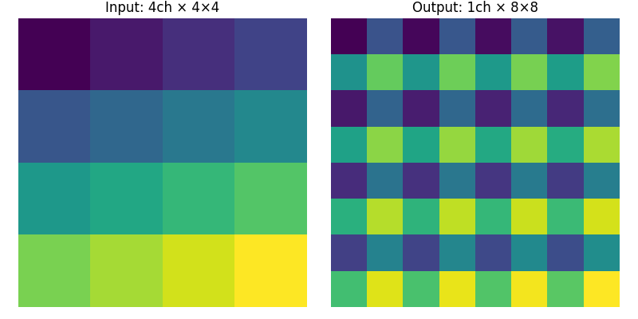
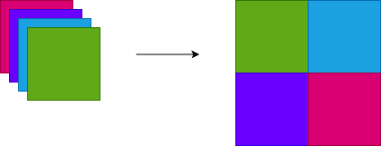
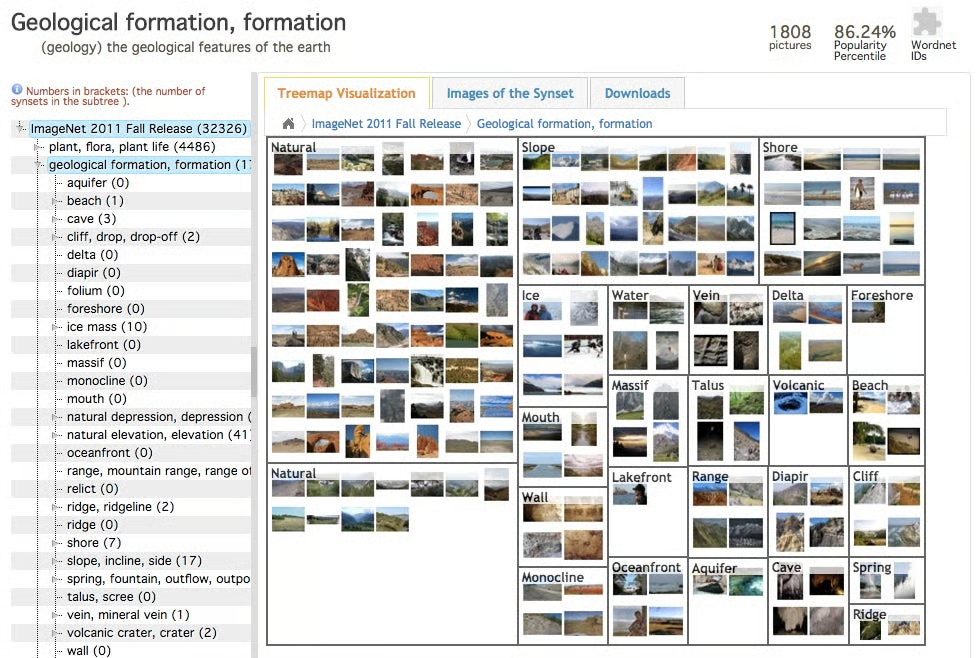

# アップサンプリング
- 5.9, 5.10章
- p108–p123
Kenichiro Goto

---

## up-samplingの導入
ここまでは変わらない / ダウンサンプリングを扱ったが、画像を生成・補完する場合はサイズを拡大するCNNが必要

- 空間方向のサイズとは: width × height（画像サイズ）
- タスク例:
  - コンパクトなベクトルから画像を生成（1×1×K → 2×2×(K/2) → … → W×H×1）
  - セグメンテーション（W×H×1 → … → 1×1×K → … → W×H×1）
  - 教科書p108図5.19

|  |down-sampling (エンコーダ) | up-sampling (デコーダ) |
| :--: |:--: |:--:|
|役割 | 特徴抽出 | 再構成・生成 |

---

## アップサンプリング＋補完＋畳み込み
サイズ拡大の最も単純な方法は、アップサンプリングと補完をペアで使い、その後に畳み込みを行う。

1. 画素値 $x_{ij}$ を r 画素間隔でとびとびに再配置（アップサンプリング）
2. 要素がスパースな行列の間の画素を補完（この時点で画像が r 倍）
3. 畳み込み（フィルタは学習対象）

---

## 実例
$$
X =
\begin{bmatrix}
1 & 2 \\
3 & 4
\end{bmatrix}
$$

$$
X_{\text{upsampled}} =
\begin{bmatrix}
1 & \phantom{0} & 2 & \phantom{0} \\
\phantom{0} & \phantom{0} & \phantom{0} & \phantom{0} \\
3 & \phantom{0} & 4 & \phantom{0} \\
\phantom{0} & \phantom{0} & \phantom{0} & \phantom{0}
\end{bmatrix}
$$

$$
X_{\text{interpolated}} \approx
\begin{bmatrix}
1.0 & 1.5 & 2.0 & 2.0 \\
2.0 & 2.4 & 2.8 & 3.0 \\
3.0 & 3.5 & 4.0 & 4.0 \\
3.0 & 3.4 & 3.8 & 4.0
\end{bmatrix}
$$

---

## 転置畳み込み
1. 入力 $x_{ij}$ の各画素の間に stride 分の 0 を挿入
2. **補完をしない**→  zero insertionによるアップサンプリング
3. フィルタ $h'$ (通常の畳み込み時のフィルタの要素を並び替えたもの)で畳み込み

- 形式的には、通常の畳み込みが $u = W x$ なら、転置畳み込みは $x = W^T u$
  - 実装上はstrideとpaddingの逆操作を組み合わせた畳み込みとして実現する
    - padding $\rightarrow$ トリミング
    - stride（出力間引き）$\rightarrow$ 0挿入して長さ合わせる

<!-- - 出力サイズは次式で表せる：
  $$
  H_{out} = (H_{in} - 1) \times s - 2p + k + \text{output\_padding}
  $$ -->
- チェッカーボードアーティファクトが起こり得る
  - strideとカーネルサイズの整合性が崩れている時

---

## 実例
$$
X =
\begin{bmatrix}
1 & 2 \\
3 & 4
\end{bmatrix}
$$

$$
X_{\text{zero-inserted}} =
\begin{bmatrix}
1 & 0 & 2 & 0 \\
0 & 0 & 0 & 0 \\
3 & 0 & 4 & 0 \\
0 & 0 & 0 & 0
\end{bmatrix}
$$

---
### 転置畳み込みのcheckerboardパターン

---

#### checkerboardパターンがなぜいけないか
- 生成画像の背景がブロック状に崩れる
- 出力が空間的に不均一→誤差勾配が不均一→学習が偏り収束しなかったり、不自然な模様が残る
など弊害がある

---

## up-convolution / subpixel convolution
- 転置畳み込みとは異なり、**ゼロ挿入も補完も行わず**チャネル方向に圧縮されていた特徴マップを空間方向に再配置して画像を拡大する。

- zero-insertionを使わないで拡大

---

### 実例
$x^{(i)}$ を行列や値だと考えると $x_{in}$ はテンソルやベクトルになっていて、それを一枚の行列に直すイメージ

$$
x_{\text{in}} =
\begin{bmatrix}
x^{(1)} & x^{(2)} & x^{(3)} & x^{(4)}
\end{bmatrix}
\quad\Rightarrow\quad
x_{\text{out}} =
\begin{bmatrix}
x^{(1)} & x^{(2)} \\
x^{(3)} & x^{(4)}
\end{bmatrix}
$$

---

## 拡大畳み込み
転置畳み込みやアップサンプリング＋補完と異なり、拡大畳み込みは、低解像度空間上での畳み込みによって高解像度画像を生成する。計算コストを抑えつつ、学習により滑らかな拡大表現を獲得できる。

1. 入力 $x_{ij}$ (例2×2)に対して出力チャネル数を $r^2$ （倍率rの場合）とする畳み込みをする
2. 得られた各チャネルを、空間的に再配置することで解像度を $r$ 倍に拡大する（pixel shuffle）
   - 例：2×2×4 → 4×4×1
3. （optional）高周波成分の平滑化を目的として、shuffle 後に追加の畳み込みを行う
   - ブロック状アーティファクトを抑えつつ滑らかな補完が可能

---

### 実例

$$
X = \begin{bmatrix}
1 & 2 \\
3 & 4 
\end{bmatrix}
$$
1. 畳み込み (チャネル数は $r^2$ 倍)
$$
F_0 = F_1 = F_2 = F_3 = 
\begin{bmatrix}
1 & 2 \\
3 & 4 
\end{bmatrix}
$$

2. Pixel Shuffle（r=2）
$$
X_{expanded} = 
\begin{bmatrix}
  1 & 1 & 2 & 2 \\
  1 & 1 & 2 & 2 \\
  3 & 3 & 4 & 4 \\
  3 & 3 & 4 & 4 \\
\end{bmatrix}
$$

---

## 拡大畳み込みと縮小→拡大の等価性
- ダウンサンプリング→畳み込み→アップサンプリング
- 1回の拡大畳み込み
上記の二つは条件付きで近似可能。

- 手順A: 入力 x をダウンサンプリング (1/r) → フィルタ h を畳み込み → アップサンプリング (r)
- 手順B: 倍率 r の拡大畳み込みを適用 → 必要ならダウンサンプリング (1/r)
- 結果が一致するのは **特定のフィルタ設計や境界条件を満たす場合のみ**
- 一般のCNNでは完全等価ではないが、近似

---

## U-Net
CNN で一度縮小した後、失われた空間解像度を後半で取り戻すのは難しい $\\\rightarrow$ これに対応し解像度を回復させるためのアイデアが U-Net
$\rightarrow$ ResNetとは加算の計算方法が違う
- 低層の空間情報を直接高層に伝達して、復元性能を向上

---

## シフト＆スティッチ（補足）
シフト＆スティッチという手法も存在するが、効率が悪く実用性は低い

---

## 物体カテゴリ認識の適用例（ImageNet）
- ImageNet は 1000 クラス・計約 128 万枚の画像からなるデータセット
- AlexNet (2012)がImageNetを用いたブレークスルーとして有名

https://qz.com/1034972/the-data-that-changed-the-direction-of-ai-research-and-possibly-the-world

---

## AlexNet と層出力の可視化
教科書には AlexNet を用いた各層の出力やテスト結果が掲載されている。

- 低層: エッジ/テクスチャ、中層: パーツ、高層: カテゴリ概念
- 中間層の活性マップや誤分類例が人間にとっての理解を補助している
  > ここを理解したい

