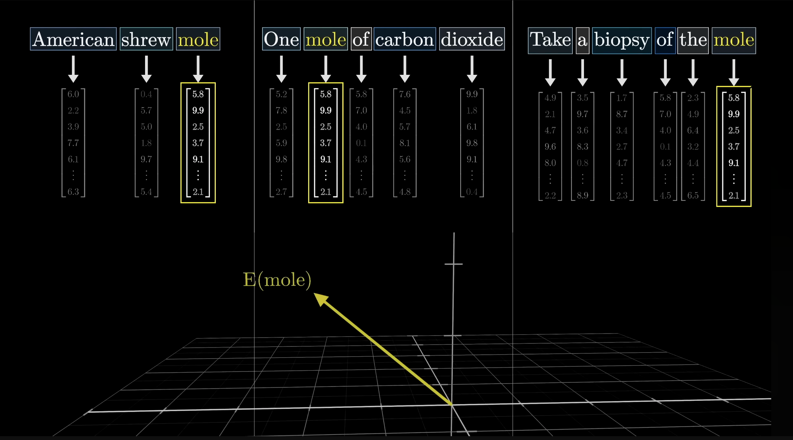
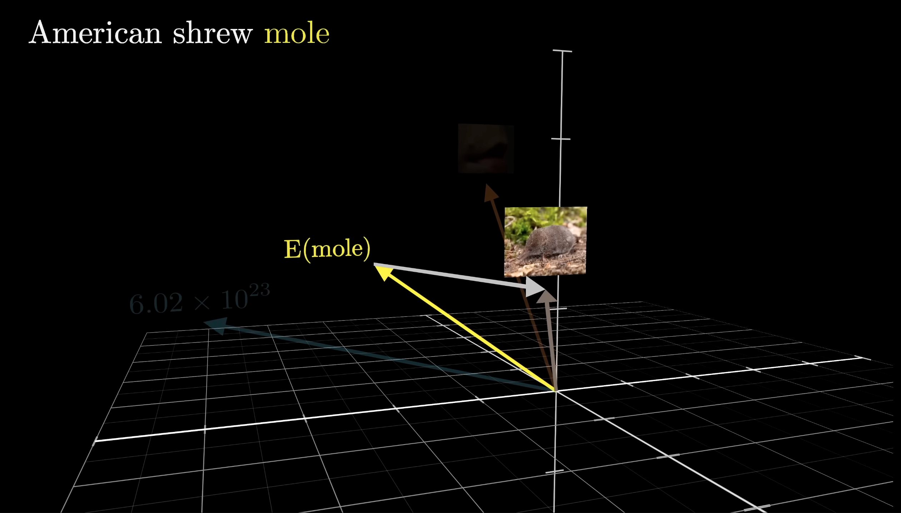
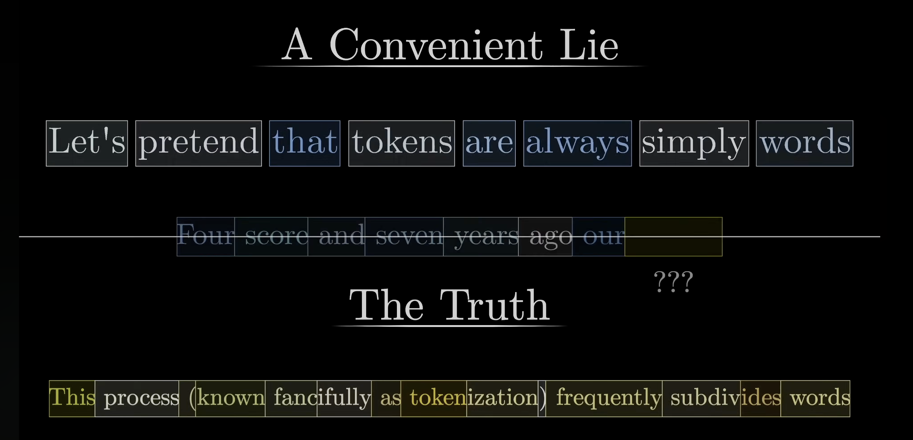

## 注意機構とトランスフォーマー
- 教科書p152-p155
- 7.2.3-7.3.2

Kenichiro Goto
2025-10-31

---

### 7.2.3 関連性の計算
- Attention の本質は、**入力のどの部分に注目すべきか** を決めること。たとえば、人が文章を読むとき、すべての単語を均等に見るわけではなく、重要な単語をより強く意識する。
- この重みづけの計算をNN（重み探索）で再現するのが注意機構
- まず、ソース（情報の送り手） $\mathbf{z}$ とターゲット（受け手） $\mathbf{q}$ の関連性 $r$ を定量化する必要がある。最もシンプルな方法は、二つのベクトルの内積を取ること

$$
r(\mathbf{z}, \mathbf{q}) = \frac{\mathbf{z}^{\top} \mathbf{q}}{\sqrt{D}}
$$

$\sqrt{D}$ で割ることによる正規化は単なる数値調整ではなく、データの次元が大きいほど、内積が自然と大きくなってしまう問題を防ぐために導入されている。
これがないと、softmaxが極端な分布（ほぼ0か1）を出してしまい、学習が不安定になる。

---

#### 乗算的注意 (multiplicative attention)

上式をより柔軟にするには、単なる内積ではなく学習可能な重み行列 $\mathbf{W}$ を挿入する
$$
r(\mathbf{z}, \mathbf{q}) = \frac{\mathbf{z}^{\top} \mathbf{W} \mathbf{q}}{\sqrt{D}}
$$
- $\mathbf{z}$, $\mathbf{q} \in \mathbb{R}^D$
- $\mathbf{W} \in \mathbb{R}^{D \times D}$

これは**どの次元をどれだけ重視するか**を学習できるようにする操作に対応する
今回の資料ではこの方式を用いる

---

#### 加算的注意 (additive attention)

一方、加算的注意は内積ではなく、ベクトルを結合して非線形変換を加える

$$
r(\mathbf{z}, \mathbf{q}) = \text{ReLU} \left( \mathbf{w}^\top \begin{bmatrix} \mathbf{z} \\ \mathbf{q} \end{bmatrix} \right)
$$
- 1層以上の順伝播型ネットワークを用いて $r()$を定義したパターン
<!-- TODO: ・の表示の仕方を調べる -->

---

### 7.2.4 畳み込み層のための注意機構

圧縮・励起 (squueze-excitation) ネットワーク(**SE-Net**)
チャネル間の重要度を学習して重み付けを行うもので、CNNの性能を高める。

---

## 7.3 トランスフォーマー

transformerは、attention機構を取り入れたNN
もともと自然言語処理で登場したが、いまや画像、音声、マルチモーダルとあらゆる分野に広がっている
すべての入力同士が互いに注意を向け合うという発想からなる
transformerの狙いは**埋め込みベクトルを調整していきより豊かな周囲の文脈情報を取り込んだもの**にすること
$$
\mathcal{A}(\mathbf{Q}, \mathbf{K}, \mathbf{V}) = \mathrm{softmax} \left( \frac{\mathbf{Q} \mathbf{K}^\top}{\sqrt{D}}\right) \mathbf{V}
$$
の理解を目的としよう

---

### （補足）文脈情報を取り込むとは
一対一対応の埋め込みベクトルにどんなベクトルを加えれば文脈にあった埋め込みベクトルになるかを学習すること
| 文脈なしのベクトル | 文脈を考慮したベクトル |
|:----------------:|:-------------------:|
|  |  |

> https://youtu.be/j3_VgCt18fA?si=nyZpsirPkVWe9uNC

---

### （補足）そもそものQuery, Key, Valueって何？
Attentionでは、各トークンが「どのトークンに注目するか」を決める必要がある
→ そのために3つのベクトルを使う
| 名称            | 役割         | 人の注意にたとえた説明   |
| ------------- | ---------- | --------------- |
| **Query (Q)** | 注目したい側（質問） | 私は何に注目すべき？  |
| **Key (K)**   | 注目される側の特徴  | 私はどんな情報を持っている |
| **Value (V)** | 実際に取り出す情報  | 注目されたら渡す内容    |

---

### 7.3.1集合データ上の注意

入力の順序や形状に依存しない集合データを入力にとる（入出力関係が同変）
transformer内部ではまず、入力が **token** $\mathbf{x}_n$ に変換される (**Embedding**)
$$
\mathbf{x}_i = \mathrm{Embed}(t_i) \in \mathbb{R} ^D
$$
たとえば文を単語の集合とみなして、それぞれのトークン（単語ベクトル） $\mathbf{x}_i$ が他のすべてのトークンに注意を向ける。

---

$$
\mathrm{this} \rightarrow \begin{bmatrix}
    5.4  &7.1 & 5.4 & \dotsb & 3.8
\end{bmatrix}^\top \\
\mathrm{ process} \rightarrow \begin{bmatrix}
    2.8  & 9.2 & 3.6 & \dotsb & 2.1
\end{bmatrix}^\top
$$
> https://youtu.be/j3_VgCt18fA?si=rcAMRBQnUVwFbu6a

---

#### transformerの内部計算
まずクエリ（ターゲット） $\mathbf{q}$ が全入力（ソース） $[\mathbf{x}_1, \dots, \mathbf{x}_N]$ に対して関連度（注意の重み）を計算する
$$
[a_1, \dots, a_N] = \text{softmax} \left(\frac{\mathbf{q}^\top \mathbf{X}^\top}{\sqrt{D}} \right)
$$
ここで $a_i$ はどのトークンにどれだけ注目するかを表す重み。この重みを使って、入力の情報を集約する
$$
\tilde{\mathbf{q}}^\top = \sum^N_{i=1}a_i\mathbf{x}_i^\top = \text{softmax} \left(\frac{\mathbf{q}^\top \mathbf{X}^\top}{\sqrt{D}} \right) \mathbf{X}
$$

クエリが複数ある場合は、行列演算でまとめて処理できる
$$
\tilde{\mathbf{Q}} = \text{softmax} \left(\frac{\mathbf{Q} \mathbf{X}^\top}{\sqrt{D}} \right) \mathbf{X}
$$

---

## 7.3.2 重みの導入とマルチヘッド注意
しかし、1つの視点（クエリ）だけで全ての関係を捉えるのは難しい。モデルに複数の視点（head）を持たせるのが **マルチヘッド注意 (multi-head attention)** 

**マルチヘッド注意（multi-heal attention）** ではクエリの他、注意の重みも複数生成し並列処理する
一般的な Attention の形式を次のように書ける
$$
\mathcal{A}(\mathbf{Q}, \mathbf{K}, \mathbf{V}) = \mathrm{softmax} \left( \frac{\mathbf{Q} \mathbf{K}^\top}{\sqrt{D}}\right) \mathbf{V}
$$
各ヘッドは異なる特徴に注目し、全体として多角的な情報抽出が可能になる。たとえばあるヘッドは文法構造、別のヘッドは意味的関連に注目する

---

#### 注意の計算を並列実行

各注意 $h(=1, 2, \dots H)$ では $\mathbf{Q}, \mathbf{K}, \mathbf{V}$ の各行のベクトルをD(クエリの次元)より小さいD'に線型写像した空間で計算する
線型写像に使う行列を導入し $\mathbf{Q} \rightarrow \mathbf{Q} \mathbf{W}^Q_h, \mathbf{K} \rightarrow \mathbf{K} \mathbf{W}^K_h, \mathbf{V} \rightarrow \mathbf{V} \mathbf{W}^V_h$ と置き換える
（各変換行列は $\mathbf{W} \in \mathbb{R}^{D\times D'}$ ）
この時注意hを次式で求める
$$
\mathrm{head}_h = \mathcal{A}(\mathbf{Q}\mathbf{W}^Q_h, \mathbf{K}\mathbf{W}^K_h, \mathbf{V}\mathbf{W}^V_h) 
$$
こうして得られた $\mathrm{head}_h$ を連結して $\mathbf{W}^O \in \mathbb{R}^{D' H \times D}$ により線型写像して統合して最終的なattentionを得る
$$
\mathcal{A}^M(\mathbf{Q}, \mathbf{K}, \mathbf{V}) = [\mathrm{head}_1, \dots, \mathrm{head}_H]\mathbf{W}^O
$$
これにより、単一の注意では捉えきれない多面的な関係を一度に（並列計算で）学習できる

---

## 補足: tranformerの処理
1. 入力tokenのembedding
2. 位置情報の付与 (次の発表者による)
    $\mathbf{x}_i' = \mathbf{x} + \mathbf{p}_i$
3. Query, Key, Valueの生成
4. attentionの計算
5. attention出力を求める
6. headを並列計算、結合しmulti-headを求める
7. 残差接続・正規化
8. フィードフォワード層で非線形変換
9. Multi-Head Attention → 残差 → FFN → 残差 までを1ブロックとし積み上げる
