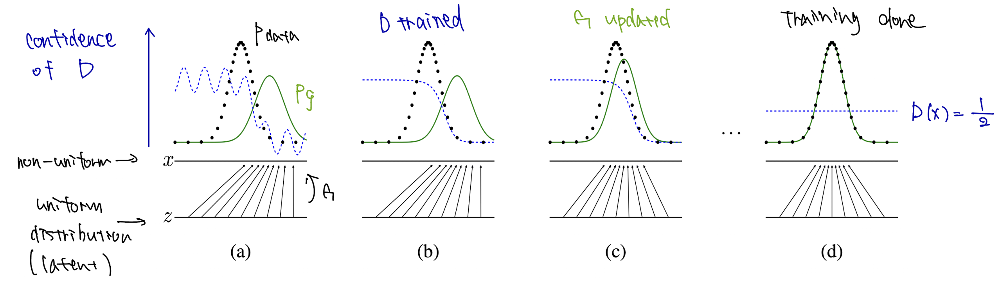

# 12.4 敵対的生成ネットワーク (GAN)
pp302-308
Presented by Kenichiro Goto

---

### 12.4.1 基本的なGAN

**[敵対的生成ネットワーク (Generative Adversarial Networks)](https://arxiv.org/abs/1406.2661)**

目標：データ $\mathbf{x}$ の分布 $p(\mathbf{x})$ をサンプル $D = \{\mathbf{x}_1, \ldots, \mathbf{x}_N\}$ を学習して表現すること

$p(\mathbf{x})$ そのものを推定するのではなく、そこをスキップして直接 $\mathbf{x} \sim p(\mathbf{x})$ を簡単に生成できることを狙う

---

#### 仕組み

潜在変数 $\mathbf{z}$ をある分布（正規分布とか）$p(\mathbf{z})$ からサンプリングし、ネットワーク $G$ への入力とする
一つの入力 $\mathbf{z}$ に対し一つの出力 $\mathbf{x} = G(\mathbf{z})$ が対応づく

$G$ (**g**enerate) の目標
ランダムな $z$ を受け取り、$p(\mathbf{x})$ からサンプリングされたと言われても納得できる $\mathbf{x}$ を出力すること
この際 $p_{data}(\mathbf{x})$ の形は感知しない

$D$ (**d**iscreminate) の目標
$\mathbf{x}$ を受け取り、それが $p(\mathbf{x})$ （本物）からサンプリングされたものなのか、それとも $G$ により生成された偽物なのかを正しく分類する2クラス分類をすること

$G$ はこの際、$D$ に偽物だと判断されない良質な偽物を生成することを狙う

---

#### GANの目的関数と学習

この互いが切磋琢磨する様子を2プレイヤーのミニマックスゲームとして捉え、次のように定式化する

$$
\min_G \max_D \text{E}_{\mathbf{x} \sim p(\mathbf{x})} [\log D(\mathbf{x})] + \text{E}_{\mathbf{z} \sim p(\mathbf{z})} [\log (1-D(G(\mathbf{z})))] \tag{12.28}
$$

$\mathbb{E}$ は期待値

$D$ は入力 $\mathbf{x}$ が本物である確率
第1項は $\mathbf{x}$ が本物である時の $D$ の予測 $[D, 1-D]$ とその正解 $[1, 0]$ との負の交差エントロピー
第2項は $\mathbf{x}$ が偽物である時の $D$ の予測 $[D, 1-D]$ とその正解 $[0, 1]$ との負の交差エントロピー

この和はxxxxを表すので、和が大きくなるように $D$ を調整すると $\mathbf{x}$ をより正しく判別できる
第2項を小さくなるように $G$ を調整するとより自然な $\mathbf{x}$ を生成できる

https://arxiv.org/abs/1406.2661

---

### 12.4.2 学習の困難さ

GANの学習では学習の最中においても $D$ と $G$ のパラメータのバランスをとりつつ進める必要があるので難しい
学習初期では $G$ の出力の質は低く、それを $D$ が判別するのは容易
この時、式(12.28)の最大化は容易だが第2項の<u>勾配が消失してしまう</u>（$D$ が強すぎると、$D(G(z)) \approx 0$ となり、$\log(1 - D(G(z)))$ の勾配がほとんど0になる）ので $G$ の学習が進まない

---

#### モード崩壊 (mode collapse)

理想は $G$ は $p(\mathbf{x})$ から生成され得る出力 $\mathbf{x}$ を満遍なく生成できること
しかし式(12.28)にその要件は盛り込まれていないので、確実に $D$ を欺ける $\mathbf{x}$ が生成できている限り、そこからさらに改良しようとしたりはしない
これを **モード崩壊** という

#### モード崩壊への対応策

目的関数の変更
- 式(12.28)で $\min_G \log (1-D(G(\mathbf{z})))$ の部分を $\max_G \log D(G(\mathbf{z}))$ にする非飽和ゲーム
- 最尤推定ゲーム
- スペクトル正規化
- two-timescale update rule
- 勾配ペナルティ
など

---

### 12.4.3 Wasserstein-GAN (WGAN)

$$
\min_G \max_D \mathrm{E}_{\mathbf{x} \sim p(\mathbf{x})} \left[D(\mathbf{x}) \right] - \mathrm{E}_{\mathbf{z} \sim p(\mathbf{z})} \left[D(G(\mathbf{z})) \right] \tag{12.29}
$$

ネットワーク $D$ は2値分類ではなくある種の回帰を実行する
$D$（この場合はcriticと呼ばれる）は、Wasserstein距離を最大化する関数を近似するように学習され、$G$ はその距離を最小化する

この際 $D$ は[リプシッツ連続](https://ja.wikipedia.org/wiki/%E3%83%AA%E3%83%97%E3%82%B7%E3%83%83%E3%83%84%E9%80%A3%E7%B6%9A)（微分値が発散しないような連続性）であることが要請され、そのために $D$ の各層の重みを常に一定の範囲 $[-c, c]$ に収める処理が採られる

---

### 12.4.4 条件付きGAN (conditional GAN)

これまでのGANはノイズ $\mathbf{z}$ を受け取り $G$ が $\mathbf{x}$ を生成する

どんな数字の画像が生成されるはわからない
**条件付きGAN** は選んだ数字の画像を生成することを可能にする

$G, D$ が入力に付加情報 $\mathbf{y}$ を加えた二つのベクトルを取るように、$G(\mathbf{z}, \mathbf{y}), D(\mathbf{x}, \mathbf{y})$ のようにデザインする

---

#### conditional GANの定式化

$\mathbf{y}$ をクラスラベルの1-of-K符号とする
$G$ は $\left[ \mathbf{z}^\top , \mathbf{y}^\top \right]$ を入力にとり $\mathbf{x}$ を生成する
$D$ は $\mathbf{x}, \mathbf{y}^\top$ を入力にとり、$\mathbf{x}$ がどれだけ $\mathbf{y}$ によって指定された数字クラスっぽく見えるかの確率を出力する

学習の定式化
$$
\min_G \max_D \mathbb{E}_{\mathbf{x} \sim p(\mathbf{x})} \left[\log D(\mathbf{x}, \mathbf{y}) \right] + \mathbb{E}_{\mathbf{z} \sim p(\mathbf{z})} \left[\log \left( 1- D(G(\mathbf{z}, \mathbf{y}), \mathbf{y} ) \right) \right] \tag{12.30}
$$

// TODO: 式理解して説明考えておく

---

#### **AC-GAN (auxiliary classifier GAN)**

$D$ は真贋判定と $\mathbf{x}$ のクラス分類を同時に行う
$D$ は
- 入力： $\mathbf{x}$
- 出力：$\mathbf{x}$ が本物である確率と $\mathbf{x}$ の各クラスのスコア $p(C_k | \mathbf{x}) (k=1, \dotsb, K)$

$G$ は
- ノイズ $\mathbf{z}$ とクラスラベルの1-of-K符号 $\mathbf{y}$ を入力
- 出力： $\mathbf{x}$

---

#### 学習

2値分類の負の損失
$$
\mathbf{L}_s = \mathbb{E}_{\mathbf{x} \sim p(\mathbf{x})} [\log D(\mathbf{x})] + \mathbb{E}_{\mathbf{z} \sim p(\mathbf{z})} [\log (1-D(G(\mathbf{z})))] \tag{12.31}
$$

$L_c$ は $D$ での $\mathbf{x}$ のクラス分類に関する損失で $D$ の出力するクラススコアと正解 $\mathbf{y}$ の交差エントロピー

これで定義される $L_c + L_s$ を $G$ に関して小さく、$L_c - L_s$ を $D$ に関して小さくする

---

### 12.4.5 pix2pix と CycleGAN

#### pix2pix

条件付きGANを使って画像 → 画像への変換を学習するモデル

例
- 白黒画像 → カラー画像
- 線画 → 写真
- 地図 → 航空写真

教師データとして入力画像と対応する正解画像（ペアデータ）が必要

GANの損失に加えて、L1損失（出力と正解の距離）を足すことで、ノイズの少ない自然な画像を生成

---

#### CycleGAN

ペアデータがない場合でも「Aの世界 ↔ Bの世界」の画像変換を学習できるモデル

例
- 馬 ↔ シマウマ
- 夏 ↔ 冬の風景

2つの生成器（A→B, B→A）と2つの識別器を使う
Cycle Consistency Loss（元に戻したら元画像に近くなるようにする）を導入し、対応データなしでも安定して学習

---

### 12.4.6 GANのためのデータ拡張

GANの学習はデータが少ないと不安定なので多様なデータを学習させるためにデータ拡張 (augmentation) を行う
- 画像を左右反転・回転・色調変更するなど
- 生成画像にも同じ変換を加え、$D$ の判定が変わらないようにする

---

[Generative Adversarial Nets (Goodfellow et al., 2014)](https://arxiv.org/abs/1406.2661)
