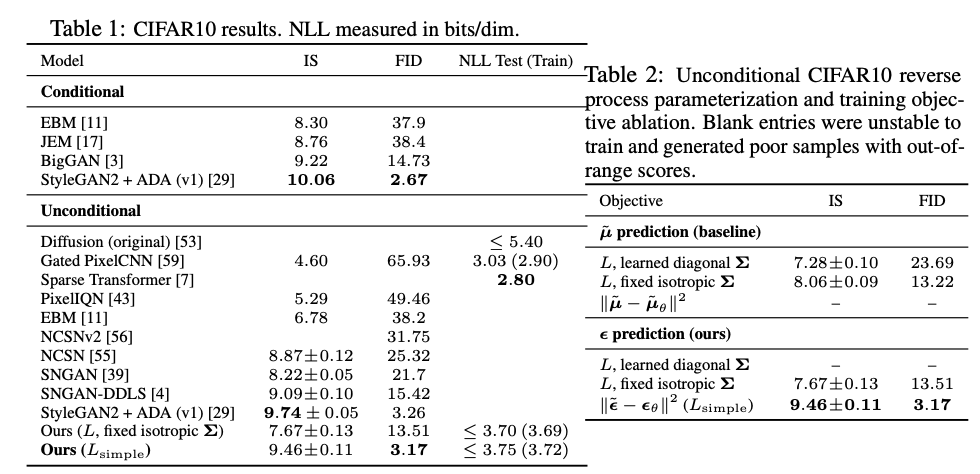

<!-- _class: lead -->

# Denoising Diffusion Probabilistic Models (DDPM)

Ho et al., 2020

 

Kenichiro Goto
西川研究室 B3
2025-11-14

---

<!-- _header: Agenda -->

1. 導入
2. メカニズムの理解
3. 理論と定式化
4. 実験とアーキテクチャ
5. 議論とまとめ
6. Appendix

---

<!-- _class : lead -->

# 1. 導入

---

<!-- _header: 1.1. 背景 -->

従来の生成モデルには以下のような弱点があった

**GAN**

* Pros: 高品質な生成
* Cons: モード崩壊, 学習が不安定（ D, Gのバランスが難しい）

**VAE**

- Pros: 尤度ベースで学習が安定
- Cons: ELBOという下界を最大化するため生成がぼやけやすい

**Flow-based Model**

- Pros: 尤度を厳密に計算可能
- Cons: 可逆変換の制約がありアーキテクチャ設計が難しい

---

<!-- _header: 1.2. DDPMの位置付け -->

DDPMは高品質かつ安定した学習（尤度ベース）の両立を目標とする

2つのプロセスで構成される
1. Forward Process (拡散過程) : データを徐々にノイズにしていく (固定プロセスでアルゴリズム的)
2. Reverse Process (逆拡散過程): 学習対象。ノイズから画像空間上のデータへ復元する

---

<!-- _header: 1.3. 論理展開流れ -->

DDPMでは、仕組みとしてはシンプルだが、随所に簡略化や性能向上のための工夫が凝らされている

拡散過程
   - 元画像 $\mathbf{x}_0$ にノイズを加算する
   - 完全なノイズ ($\mathbf{x}_T$, 標準正規分布) になるまで続ける。（ノイズから画像を生成する逆のプロセスとしたいから）
   - 数学的に扱いやすいことが重要（閉形式）

→ 逆拡散過程
   - 逆過程の真の分布は $\mathbf{x}_0$ が必要。だがそれは知ることができないのでNNでの近似をここで使う

→ NNによる近似
計算できない $q(\mathbf{x}_{t-1}|\mathbf{x}_t, \mathbf{x}_0)$ の代わりに $p_\theta$ を推定する
- 逆過程の分布  $p_\theta(x_{t-1} | x_t)$ は、平均 $\mu_\theta$ と分散 $\Sigma_\theta$ を持つ正規分布であると仮定
- NNは、$\mu_\theta$（分布の平均）を直接予測するのではなく、時刻 $t$ の画像 $x_t$ に**加えられたノイズ $\epsilon$ を予測**するように学習させる
  - なぜなら、加えられたノイズ $\epsilon$ が予測できれば、それを使って $x_{t-1}$ の平均 $\mu_\theta$ を（間接的に）計算できることが分かっているから

---

<!-- _header: 補足：Langevin Dynamics や Flow との関係 -->

**Langevin Dynamics**
- これは「スコアベースモデル（Score-Based Models）」と呼ばれる、DDPMの兄弟のようなモデル群で、サンプリング（生成）時によく使われる手法
- DDPMのサンプリングステップ（ $x_t$ から $x_{t-1}$ を生成する）は、数学的に見るとLangevin Dynamicsの1ステップと非常によく似た形になっている

**Flow-based Models**
- これはDDPMとは別の生成モデルのカテゴリ
- しかし、DDPMを連続時間で考えると（SDEやODE）、その生成プロセスはFlow-based Models の理論と深く関連することが示されている

---

<!-- _class: lead -->

# 2. メカニズムの理解

---

<!-- _header: 2.1. Forward Process (拡散過程) -->

$q(\mathbf{x}_t|\mathbf{x}_{t-1})$ : データ→ノイズ方向への変換

$$
q(\mathbf{x}_t|\mathbf{x}_{t-1}) := \mathcal{N}(\mathbf{x}_t; \sqrt{1-\beta_t}\mathbf{x}_{t-1}, \beta_t\mathbf{I}) \tag{1}
$$

- $\beta_t$ は分散スケジュール（ハイパーパラメータ）  

この正規分布からのサンプリングは、 **Reparameterization Trick** により、
以下のように「ノイズの加算」として表現できます。

$$
\mathbf{x}_t = \sqrt{1-\beta_t}\mathbf{x}_{t-1} + \sqrt{\beta_t} \boldsymbol{\epsilon} \quad (\boldsymbol{\epsilon} \sim \mathcal{N}(\mathbf{0}, \mathbf{I})) \tag{2}
$$

- 直感的な理解
  - $\sqrt{1-\beta_t}\mathbf{x}_{t-1}$ : 元の画像を少し縮小 (スケールダウン)
  - $\sqrt{\beta_t} \boldsymbol{\epsilon}$ : 小さなノイズを加算

- $t$ が大きくなるにつれて $q$ はガウシアンノイズ $\mathcal{N}(\mathbf{0}, \mathbf{I})$ に漸近する

---

<!-- _header: 2.1. Forward Process (拡散過程) -->

マルコフ性の利点： $T$ ステップの反復計算は不要。
$\alpha_t := 1 - \beta_t$, $\bar{\alpha}_t := \prod_{s=1}^t \alpha_s$ とおくと、
$\mathbf{x}_0$ から任意の $\mathbf{x}_t$ を一発でサンプリング可能（Reparameterization Trick）

$$
q(\mathbf{x}_t | \mathbf{x}_0) = \mathcal{N}(\mathbf{x}_t; \sqrt{\bar{\alpha}_t} \mathbf{x}_0, (1-\bar{\alpha}_t)\mathbf{I}) 
\quad
\mathbf{x}_t = \sqrt{\bar{\alpha}_t} \mathbf{x}_0 + \sqrt{1-\bar{\alpha}_t} \boldsymbol{\epsilon} \quad (\boldsymbol{\epsilon} \sim \mathcal{N}(\mathbf{0}, \mathbf{I})) \tag{4}
$$

これは **訓練時に極めて重要** となる。

 diffusion process of generating a sample by slowly adding (removing) noise. (Image source: Ho et al. 2020 with a few additional annotations)")

---

<!-- _header: 2.2. Reverse Process (逆拡散過程) -->

### $p_\theta(\mathbf{x}_{t-1} | \mathbf{x}_t)$ : ノイズからデータを復元する

Forward Processの逆をたどる。
$\mathbf{x}_T \sim \mathcal{N}(\mathbf{0}, \mathbf{I})$ からスタートし、ノイズを除去（Denoising）しながら $\mathbf{x}_0$ を復元する。

この逆過程 $p_\theta$ をニューラルネットワーク (NN) で近似する。
$$
p_\theta(\mathbf{x}_{0:T}) := p(\mathbf{x}_T) \prod_{t=1}^T p_\theta(\mathbf{x}_{t-1}|\mathbf{x}_t) 
\quad
p_\theta(\mathbf{x}_{t-1}|\mathbf{x}_t) := \mathcal{N}(\mathbf{x}_{t-1}; \boldsymbol{\mu}_\theta(\mathbf{x}_t, t), \boldsymbol{\Sigma}_\theta(\mathbf{x}_t, t))
\tag{5}
$$

- NN  $\boldsymbol{\mu}_\theta$ が真の逆過程の平均 $\tilde{\boldsymbol{\mu}}$ を予測するように学習する (のちに $\epsilon$ の推定に置き換えられる)
- $\boldsymbol{\Sigma}_\theta$ はDDPMでは固定値 ( $\tilde{\beta}_t\mathbf{I}$ or $\beta_t\mathbf{I}$ ) 

   
")

---

<!-- _class: lead -->

# 3. 理論と定式化

---

<!-- _header: 3.1. 損失関数の導出 -->

**どうやって学習するか** 
目標： 尤度 $p_\theta(\mathbf{x}_t)$ を最大化したい。
→ 真の逆過程 $q$ とNNによる近似 $p_\theta$ のKL divergenceを最小化したい

変分下界 (ELBO) を用いて損失 $L_\mathrm{VLB} \ge L$ を定義する (Appendix)
$$
L_\mathrm{VLB} = \mathbb{E}_q[-\log p_\theta(\mathbf{x}_{0:T}) + \log q(\mathbf{x}_{1:T}|\mathbf{x}_0)] \tag{6}
$$

これを整理すると各ステップのKL divergenceの和になる

$$
L_\mathrm{VLB} = \mathbb{E}_q[ \underbrace{D_{KL}(q(\mathbf{x}_T) || p(\mathbf{x}_T))}_{L_T} + \sum_{t>1} \underbrace{D_{KL}(q(\mathbf{x}_{t-1}|\mathbf{x}_t, \mathbf{x}_0) || p_\theta(\mathbf{x}_{t-1}|\mathbf{x}_t))}_{L_{t-1}} - \underbrace{\log p_\theta(\mathbf{x}_0|\mathbf{x}_1)}_{L_0} ] \tag{7}
$$

---

<!-- _header: 3.1. 損失関数の導出 -->

$L_{t-1}$ 項にある $q(\mathbf{x}_{t-1} | \mathbf{x}_t, \mathbf{x}_0)$ のように $\mathbf{x}_0$ で条件付けると解析的に計算可能になる (Appendix)

$$
q(\mathbf{x}_{t-1}|\mathbf{x}_t, \mathbf{x}_0) = \mathcal{N}(\mathbf{x}_{t-1}; \tilde{\boldsymbol{\mu}}_t(\mathbf{x}_t, \mathbf{x}_0), \tilde{\beta}_t \mathbf{I}) \tag{8}
$$
ここで
$$
\tilde{\boldsymbol{\mu}}_t(\mathbf{x}_t, \mathbf{x}_0) := \frac{1}{\sqrt{\alpha_t}} \left( \mathbf{x}_t - \frac{1-\alpha_t}{\sqrt{1-\bar{\alpha}_t}} \boldsymbol{\epsilon}_t \right) \tag{9}
$$

（ $\boldsymbol{\epsilon}_t$ は $\mathbf{x}_t$ の生成に使われたノイズ）

$L_{t-1}$ は、この **真の平均 $\tilde{\boldsymbol{\mu}}_t$** と **NNの予測 $\boldsymbol{\mu}_\theta$** の差を測る項になる

---

<!-- _header: 3.2 損失関数の簡略化  -->

### $L_\mathrm{simple}$ : $\boldsymbol{\epsilon}$-prediction

$L_{t-1}$ は $p_\theta$ と $q$ の平均 $\boldsymbol{\mu}$ のL2距離（MSE）として計算できる。

$$
L_{t-1} = \mathbb{E}_q \left[ \frac{1}{2\sigma_t^2} \lVert \tilde{\boldsymbol{\mu}}_t(\mathbf{x}_t, \mathbf{x}_0) - \boldsymbol{\mu}_\theta(\mathbf{x}_t, t) \rVert^2 \right] + C \tag{10}
$$

さらに、 $\boldsymbol{\mu}$ を直接予測するのではなく、
$\mathbf{x}_t = \sqrt{\bar{\alpha}_t} \mathbf{x}_0 + \sqrt{1-\bar{\alpha}_t} \boldsymbol{\epsilon}$ の関係を使って、ノイズ $\boldsymbol{\epsilon}$ を予測する 問題に置き換える。 
($\boldsymbol{\epsilon}$-prediction (Appendix))

NNで $\boldsymbol{\epsilon}_\theta(\mathbf{x}_t, t)$ が、真のノイズ $\boldsymbol{\epsilon}$ を予測するように学習する。

---
<!-- _header: 3.2 損失関数の簡略化  -->

$L_\mathrm{simple}$: 最終的な損失関数
論文では重み係数を無視した以下の単純な損失関数の方が安定しており性能も良かったと報告している

$$
L^\mathrm{simple}_t = \mathbb{E}_{t\sim[1, T], \epsilon_t} \left[\lVert \epsilon_t - \epsilon_\theta(\sqrt{\bar{\alpha}_t} \mathbf{x}_0 + \sqrt{1-\bar{\alpha}_t} \epsilon_t, t) \|^2 \right] \tag{11}
$$

$L_T$ は定数なので最終的な損失関数は式6である
ここまでをまとめると
ニューラルネット $\boldsymbol{\epsilon}_\theta$ は、入力されたノイズ画像 $\mathbf{x}_t$ と時刻 $t$ から、そこに含まれるノイズ成分 $\boldsymbol{\epsilon}$ を予測するように学習すればよい。

")

---

<!-- _header: 3.3 Score Matching との関連性 (発展) -->

損失関数 $L_\mathrm{simple}$ は、Denoising Score Matching[^1]の目的関数と密接に関連している。

データ分布の勾配 $\nabla_{\mathbf{x}} \log q(\mathbf{x})$ を「Score」と呼ぶ。
Langevin Dynamics（スコアベースのサンプリング手法）において、Scoreの推定が重要。

DDPMのノイズ予測 $\boldsymbol{\epsilon}_\theta$ は、
このScore $s_\theta$ と以下の関係にあることが示されている。
（ノイズ予測は、実質的にデータの勾配（Score）を推定している）

$$
\mathbf{s}_\theta(\mathbf{x}_t, t) = -\frac{\boldsymbol{\epsilon}_\theta(\mathbf{x}_t, t)}{\sqrt{1 - \bar{\alpha}_t}} \tag{12}
$$

> [^1] https://ieeexplore.ieee.org/abstract/document/6795935

---

<!-- _class: lead -->

# 4. 実験とアーキテクチャ

---

<!-- _header: 4.1. アーキテクチャ (U-Net) -->

### ノイズ予測器 $\boldsymbol{\epsilon}_\theta$ の実装

**ノイズ予測 $\boldsymbol{\epsilon}_\theta(\mathbf{x}_t, t)$ のNNアーキテクチャ**
- 入力 ($\mathbf{x}_t$) と 出力 ($\boldsymbol{\epsilon}$) の解像度が同じである必要がある。
- 論文では U-Net（ResNetブロック + Attention）を採用。

**時刻 $t$ の入力方法 (Time Embedding)**

- $t$ は離散値だが、そのままNNに入力しない。
- TransformerのPositional Encodingと同様の手法で高次元ベクトルに変換し、
- U-Netの各ResNetブロックに加算する。

---

<!-- _header: 4.2. サンプリング（生成） -->

学習とは逆に、Reverse Process $p_\theta$ を $T$ ステップ実行する。

1. $\mathbf{x}_T \sim \mathcal{N}(\mathbf{0}, \mathbf{I})$ （ガウスノイズ）からスタート
2. $t = T, \dots, 1$ について以下を反復
    - $\mathbf{z} \sim \mathcal{N}(\mathbf{0}, \mathbf{I})$ if $t > 1$, else $\mathbf{z} = \mathbf{0}$
    - NN $\boldsymbol{\epsilon}_\theta$ を使って $\boldsymbol{\mu}_\theta$ を計算
    - $\mathbf{x}_{t-1} = \boldsymbol{\mu}_\theta(\mathbf{x}_t, t) + \sigma_t \mathbf{z}$
    （$\boldsymbol{\mu}_\theta = \frac{1}{\sqrt{\alpha_t}} \left( \mathbf{x}_t - \frac{1-\alpha_t}{\sqrt{1-\bar{\alpha}_t}} \boldsymbol{\epsilon}_\theta(\mathbf{x}_t, t) \right)$）
3. $\mathbf{x}_0$ が生成画像

---

<!-- _header: 4.3. 生成結果 -->

**生成結果 (CIFAR-10, CelebA)**
- 評価指標: FID (Fréchet Inception Distance), Inception Score
    - 当時のSOTA（特にGAN）に匹敵、あるいは凌駕するスコアを達成。
- Ablation Study:
  - $\boldsymbol{\mu}$ 予測より $\boldsymbol{\epsilon}$ 予測の方が性能が良いことを確認。
  - 損失の重み付けを無視した  $L_\mathrm{simple}$ の方が性能が良いことを確認。

---

<!-- _class: lead -->

# 5. 議論とまとめ

---

<!-- _header: 5.1. 議論とまとめ -->

**本研究の貢献**
- 高品質な画像生成: GANに匹敵する高忠実度な画像生成を達成。
- 安定した学習: 敵対的学習が不要で、安定した尤度ベースの学習が可能。
- 理論的背景: 変分推論とScore Matchingに裏打ちされた堅牢な理論。
- 単純な実装: 最終的な損失関数は「ノイズ予測のMSE」というシンプルな形。

**課題**
サンプリング速度: $T$ ステップ (e.g., 1000〜4000) の反復計算が必要なため、推論（生成）が非常に遅い

**影響**
- DDPMの成功と課題（速度）が、爆発的な後続研究を生み出した。
  - DDIM (2020): サンプリングを高速化 (e.g., 50ステップ)
  - Latent Diffusion (2021): 高解像度化（→ Stable Diffusionの基礎）

---

<!-- _header: 参考文献 -->

[1] Ho, J., Jain, A., & Abbeel, P. (2020). "Denoising Diffusion Probabilistic Models". Advances in Neural Information Processing Systems (NeurIPS), 33. (Also available as arXiv:2006.11239).

[2] Kingma, D. P., & Welling, M. (2013). "Auto-Encoding Variational Bayes". arXiv preprint arXiv:1312.6114.

[3] Song, Y., & Ermon, S. (2020). "Score-Based Generative Modeling through Stochastic Differential Equations". International Conference on Learning Representations (ICLR). (Also available as arXiv:2011.13456).

[4] Weng, L. (2021, July 11). "What are Diffusion Models?". Lil'Log (Blog). Retrieved November 14, 2025, from https://lilianweng.github.io/posts/2021-07-11-diffusion-models/

---

<!-- _class: lead -->

# Appendix

---

<!-- _header: なぜ $\mathbf{x}_0$ で条件付けすると計算可能になるのか -->

- $q(\mathbf{x}_{t-1}|\mathbf{x}_t)$ は、考えられる全ての $\mathbf{x}_0$ について周辺化（積分）する必要があり、計算が困難
- しかし、 $\mathbf{x}_0$ を（訓練データとして）観測している前提で条件付けを行うと、ベイズの定理 $q(\mathbf{x}_{t-1}|\mathbf{x}_t, \mathbf{x}_0) = \frac{q(\mathbf{x}_t|\mathbf{x}_{t-1}, \mathbf{x}_0) q(\mathbf{x}_{t-1}|\mathbf{x}_0)}{q(\mathbf{x}_t|\mathbf{x}_0)}$ が使える
- Forward Processの定義により、右辺の3つの項（ $q(\mathbf{x}_t|\mathbf{x}_{t-1})$ , $q(\mathbf{x}_{t-1}|\mathbf{x}_0)$ , $q(\mathbf{x}_t|\mathbf{x}_0)$ ）は全て既知のガウス分布
- ガウス分布の積・商は解析的に計算可能であり、結果として $q(\mathbf{x}_{t-1}|\mathbf{x}_t, \mathbf{x}_0)$ もまたガウス分布 $\mathcal{N}(\mathbf{x}_{t-1}; \tilde{\boldsymbol{\mu}}_t, \tilde{\beta}_t \mathbf{I})$ となることが導出できる

---

<!-- _header: ε -prediction -->

- $\tilde{\boldsymbol{\mu}}_t$ と $\boldsymbol{\mu}_\theta$ は、それぞれ $\boldsymbol{\epsilon}$ と $\boldsymbol{\epsilon}_\theta$ を使って（線形変換で）表現できるため、 $\lVert \tilde{\boldsymbol{\mu}}_t - \boldsymbol{\mu}_\theta \rVert^2$ は $\lVert \boldsymbol{\epsilon} - \boldsymbol{\epsilon}_\theta \rVert^2$ の定数倍として書き直せる
$$
\begin{aligned}
\left\lVert \tilde{\boldsymbol{\mu}}_t - \boldsymbol{\mu}_\theta \right\rVert^2 &= \left\lVert \left( \frac{1}{\sqrt{\alpha_t}} \mathbf{x}_t - \frac{\beta_t}{\sqrt{\alpha_t}\sqrt{1-\bar{\alpha}_t}} \boldsymbol{\epsilon} \right) - \left( \frac{1}{\sqrt{\alpha_t}} \mathbf{x}_t - \frac{\beta_t}{\sqrt{\alpha_t}\sqrt{1-\bar{\alpha}_t}} \boldsymbol{\epsilon}_\theta \right) \right\rVert^2 \\
&= \left\lVert - \frac{\beta_t}{\sqrt{\alpha_t}\sqrt{1-\bar{\alpha}_t}} \boldsymbol{\epsilon} + \frac{\beta_t}{\sqrt{\alpha_t}\sqrt{1-\bar{\alpha}_t}} \boldsymbol{\epsilon}_\theta \right\rVert^2 \\
&= \left\lVert \frac{\beta_t}{\sqrt{\alpha_t}\sqrt{1-\bar{\alpha}_t}} (\boldsymbol{\epsilon}_\theta - \boldsymbol{\epsilon}) \right\rVert^2 \\
&= \left( \frac{\beta_t^2}{\alpha_t(1-\bar{\alpha}_t)} \right) \left\lVert \boldsymbol{\epsilon} - \boldsymbol{\epsilon}_\theta \right\rVert^2
\end{aligned} \tag{13}
$$
- したがって、損失 $L_{t-1}$ は $\boldsymbol{\epsilon}$ 予測の「重み付き」MSEとして表現できる
- しかし、DDPM論文の重要な発見として、この重み付けを全て無視し、単純なMSE $\lVert \boldsymbol{\epsilon} - \boldsymbol{\epsilon}_\theta \rVert^2$ を使った $L_\mathrm{simple}$ の方が、学習が安定し性能も向上したと報告されている

---

<!-- _header: ELBOを使った $L$ の導出 -->

ELBO：普通に求めるのは難しい尤度 $- \log p_\theta$ を求めるためにそれを常に上回る値のこと

$$
\begin{align*}
-\log p_\theta(\mathbf{x}_0) &\leq -\log p_\theta(\mathbf{x}_0) + D_{KL}(q(\mathbf{x}_{1:T}|\mathbf{x}_0) || p_\theta(\mathbf{x}_{1:T}|\mathbf{x}_0)) \quad ; \text{KL is non-negative} \\
&= -\log p_\theta(\mathbf{x}_0) + \mathbb{E}_{\mathbf{x}_{1:T} \sim q(\mathbf{x}_{1:T}|\mathbf{x}_0)} \left[ \log \frac{q(\mathbf{x}_{1:T}|\mathbf{x}_0)}{p_\theta(\mathbf{x}_{0:T})/p_\theta(\mathbf{x}_0)} \right] \\
&= -\log p_\theta(\mathbf{x}_0) + \mathbb{E}_q \left[ \log \frac{q(\mathbf{x}_{1:T}|\mathbf{x}_0)}{p_\theta(\mathbf{x}_{0:T})} + \log p_\theta(\mathbf{x}_0) \right] \\
&= \mathbb{E}_q \left[ \log \frac{q(\mathbf{x}_{1:T}|\mathbf{x}_0)}{p_\theta(\mathbf{x}_{0:T})} \right] \\
\text{Let } L_{VLB} &= \mathbb{E}_{q(\mathbf{x}_{0:T})} \left[ \log \frac{q(\mathbf{x}_{1:T}|\mathbf{x}_0)}{p_\theta(\mathbf{x}_{0:T})} \right] \geq -\mathbb{E}_{q(\mathbf{x}_0)} \log p_\theta(\mathbf{x}_0) \tag{14}
\end{align*}
$$
