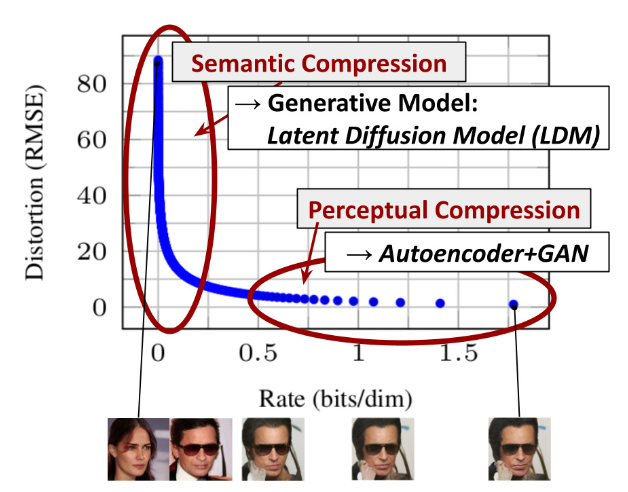
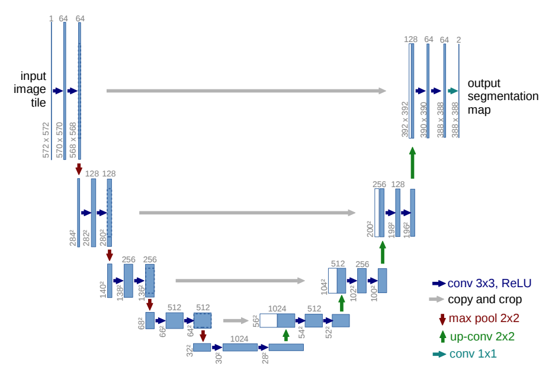
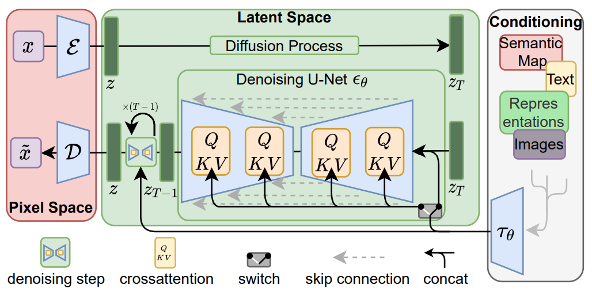
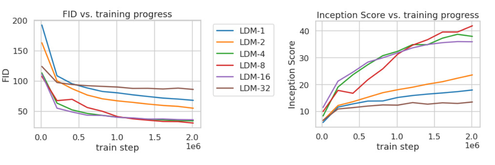
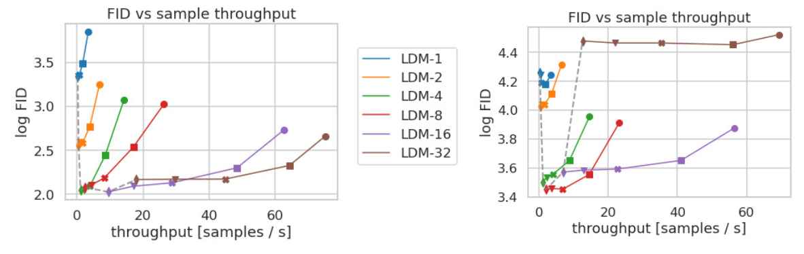
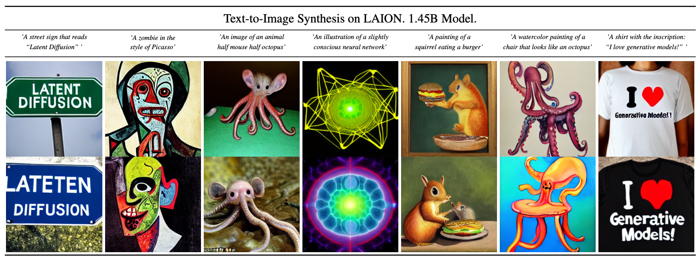
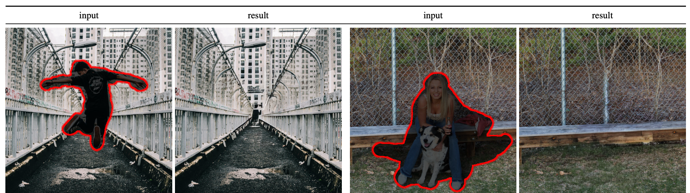
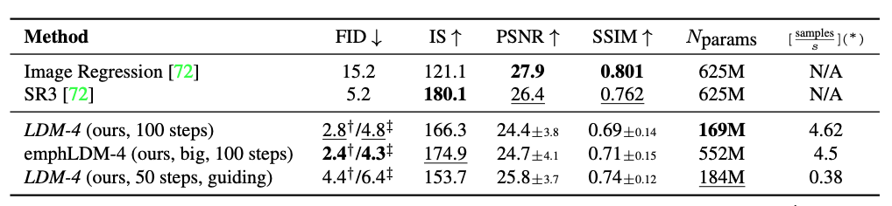

<!-- _class: lead -->

# High-Resolution Image Synthesis with Latent Diffusion Models

Kenichiro Goto
Paper: Rombach et al., CVPR 2022  
(CompVis, LMU Munich & Runway ML)
2025 Dec 5

---

<!-- _header: Agenda-->

- Abstract
- モチベーション
- 提案手法
- 既存手法との比較
- Perceptual Image Compression (Stage 1)
- Latent Diffusion Models (Stage 2)
- Conditioning Mechanisms
- なぜCross Attentionで条件付けが可能になるのか?
- なぜピュアなtransformerではなくU-netなのか?
- アーキテクチャ
- 実験
- 多様なタスクにおける成果
- まとめ
- 参考文献
---

<!-- _header: Abstract -->

本論文の提案は、Latent Diffusion Models (LDMs) 

- 背景: 従来の拡散モデル（DDPM等）はピクセル空間で動作するため、学習・推論の計算コストが極めて高い。  
- 提案: 学習済みのAutoencoderを用いて画像を低次元の潜在空間へ圧縮し、その空間上で拡散モデルを学習する。  
- 成果
  - 画質を維持しつつ、計算コストを劇的に削減
  - 推論速度の高速化
  - Cross-Attention層の導入により、テキストやレイアウトなどの柔軟な条件付けが可能に。  
  - Inpainting, Super-resolution, Text-to-ImageでSOTAまたはそれに匹敵する性能を達成。
  
---

<!-- _header: モチベーション -->

前回触れたDDPMなどは、高解像度画像の生成において優れた性能を示すが、いくつか問題点がある。
これらはピクセル空間で計算を行うことに起因する

1. 計算コスト: 高次元なRGB画像の各ピクセルに対してデノイズ処理を行うため、学習には大量のGPUを要し推論も低速
  - e.g. 150-1000 V in 100 days
  - モデルは各ステップで $256 \times 256 \times 3$ px分のノイズを予測しないといけない
2. 知覚的冗長性: 画像の細部（高周波成分）の学習に多くの計算リソースを消費しているが、これらは意味的な内容とは必ずしも直結しない

**アプローチ**
- Perceptual Compression
- Semantic Generation

にプロセスを分離する。
「画像の大半は知覚的詳細であり、意味的・概念的な部分は圧縮後も残っているはずである」[2] という発想からきている

---

<!-- _header: 提案手法-->

LDMは大きく2つのステージに分かれる。
1. Perceptual Compression
   - ピクセル空間 $x$ を知覚的に等価な低次元の潜在空間 $z$ に圧縮する。  
   - ピクセル空間での冗長性・高周波成分を取り除き、計算効率を上げる
   - 形状・色・意味的な構造などhigh-levelな情報は維持
2. Latent Diffusion
   - 圧縮された潜在空間 $z$ 上で拡散過程を行う。  
   - 空間的な次元が減るため、高解像度画像の生成も効率的に行える

> [1]

---

<!-- _header: 既存手法との比較 -->

| Method   | Latent Type  | Pros  | Cons   |
| ------ | ---- | ----------- | ----- |
| VQGAN + Transformer | Discrete latent   | 高品質; transformer由来の柔軟性 | でかい(>1B)ので遅い |
| Pixel-based DDPM | Pixel | 最も忠実 | 高コスト |
|LDM| Continuous latent | 高速・高画質・汎用的 | Autoencoderに依存 [2]|

> [2] Weng, Lilian. (Jul 2021). What are diffusion models? Lil’Log. https://lilianweng.github.io/posts/2021-07-11-diffusion-models/.

---

<!-- _header: Perceptual Image Compression (Stage 1) -->

学習済みAutoencoder ($\mathcal{E}, \mathcal{D}$) を利用する

- Encoder $\mathcal{E}$: 画像 $x \in \mathbb{R}^{H \times W \times 3}$ を潜在表現 $z = \mathcal{E}(x) \in \mathbb{R}^{h \times w \times c}$ にエンコード
  - ダウンサンプリング係数 $f = 2^m \quad \mathrm{where} \quad m \in \mathbb{N}$  
- Decoder $\mathcal{D}$: 潜在表現から画像を再構成 $\tilde{x} = \mathcal{D}(z)$
- 正則化: 潜在空間の分散を抑えるため、(i)KL正則化または(ii)VQ正則化を使用

Encoderは一度学習すれば、様々なタスクのDMsの学習に**再利用可能**

---

<!-- _header: Latent Diffusion Models (Stage 2) -->

潜在空間 $z$ に対する拡散モデル

* Forward Process: $z$ にガウシアンノイズを徐々に追加し、純粋なノイズにする（DDPMと同様）。  
* Reverse Process: ノイズから $z$ を復元するよう、Denoising U-Net $\epsilon_\theta$ を学習。

**目的関数**

ピクセル $x$ ではなく、潜在変数 $z (= \mathcal{E}(x))$ に対して最適化を行う。
$$
L_{LDM} := \mathbb{E}_{\mathcal{E}(x), \epsilon \sim \mathcal{N}(0,1), t} \left[ || \epsilon - \epsilon_\theta(z_t, t) ||_2^2 \right]
$$

-  $t$: タイムステップ  
- $z_t$: ノイズが加わった時点 $t$ の潜在表現  
- $\epsilon_\theta$: ノイズ予測ネットワーク (Time-conditional U-Net)

**DDPMとの比較**

$$
L_{LDM} := \mathbb{E}_{\mathcal{E}(x), \epsilon \sim \mathcal{N}(0,1), t} \left[ || \epsilon - \epsilon_\theta(z_t, t) ||_2^2 \right] \tag{1}
$$
$$
L_{DDPM} := \mathbb{E}_{\mathcal{E}(x), \epsilon \sim \mathcal{N}(0,1), t} \left[ || \epsilon - \epsilon_\theta(x_t, t) ||_2^2 \right] \tag{2}
$$

---

<!-- _header: Conditioning Mechanisms-->

LDMの強力な特徴は、テキスト、画像、レイアウトなど多様な入力 $y$ で生成を制御できる点。

**Cross-Attention の導入**
U-Netの中間層にCross-Attention機構を組み込み条件 $y$ を注入する

1. ドメイン固有のエンコーダ $\tau_\theta$ (例: BERT, CLIP) で $y$ を中間表現に変換。  
2. U-Netの特徴マップ $\varphi_i(z_t)$ と Attention をとる。

$$
Attention(Q, K, V) = softmax\left(\frac{QK^T}{\sqrt{d}}\right) \cdot V
$$
$$
Q = W_Q^{(i)} \cdot \varphi_i(z_t), \quad K = W_K^{(i)} \cdot \tau_\theta(y), \quad V = W_V^{(i)} \cdot \tau_\theta(y)
$$

$$
\rightarrow \quad Q =  \varphi_i(z_t) \cdot W_Q^{(i)} , \quad K =  \tau_\theta(y) \cdot W_K^{(i)} , \quad  V =  \tau_\theta(y) \cdot W_V^{(i)}
$$

- $\tau_\theta (y) \in \mathbb{R}^{M \times d_\tau}$
- $\varphi_i(z_t) \in \mathbb{R}^{N \times d_\epsilon^{(i)}} \rightarrow \mathbb{R}^{N \times d_i}$
- $W_Q^{(i)} \in \mathbb{R}^{d \times d_\epsilon^{(i)}} \rightarrow \mathbb{R}^{d_i \times d}　,\; W_K^{(i)} \in \mathbb{R}^{d \times d_\tau} \rightarrow \mathbb{R}^{d_\tau \times d} ,\; W_V^{(i)} \in \mathbb{R}^{d \times d_\tau} \rightarrow \mathbb{R}^{d_\tau \times d}$

---

- $i$: U-netのブロックのインデックス。つまり各ブロックに対してQ, K, Vのprojectionが存在する
- $M$: テキスト埋め込みを生成するエンコーダ（Transformer）の出力token長 (CLIPなら $M=77$ )
- $d_\tau$: 1 token embeddingあたりの次元数（CLIP では 768 固定）
- $N$: 画像の空間位置の総数 ( $= h \times w$ )。attentionに入れる前にこのような空間方向の圧縮をするのは典型的
- $d$: attention headの次元。ハイパーパラメータ

以上を組み込んで、最終的なlossは

$$
L_{DDPM} := \mathbb{E}_{\mathcal{E}(x), \epsilon \sim \mathcal{N}(0,1), t} \left[ || \epsilon - \epsilon_\theta(x_t, t, \tau_\theta(y)) ||_2^2 \right] \tag{3}
$$

---

<!-- _header: なぜCross Attentionで条件付けが可能になるのか? -->

- 画像側特徴 $\varphi (\mathbf{z}) \rightarrow$  Query
- テキスト側特徴 $\tau (\mathbf{y}) \rightarrow$ Key / Value

$\mathrm{Attention}(Q, K, V)$ で画像のどの空間位置がテキストのどの単語と対応すべきかという依存関係を学習
- Key-Value はテキストの意味を持っており、Query は 画像の生成途中の特徴マップを指す
- $\mathrm{softmax}(\mathbf{Q}\mathbf{K}^\top)$ により、位置ごとに関連単語が選ばれる
これによりテキストと画像の対応 (つまり条件付け) が自然に形成される

---

<!-- _header: なぜピュアなtransformerではなくU-netなのか? -->

U-Net [4] は 局所性を強く持つアーキテクチャであり、そのinductive biasを利用するため
  - Encoderで粗い情報を取得しDecoderで細かい情報を復元、skip connectionで両者を統合
  - 画像の構造（エッジ・パーツ・形状）を自然に扱える

ピュアなTransformer は fully-connected attentionのため、画像の局所構造を学習するには大量データ・計算が必要

LDM は latent space で計算し比較的低解像度なのでCNN の inductive bias が効率的に働く

> [4] https://arxiv.org/abs/1505.04597

---

<!-- _header: アーキテクチャ -->

1. Pixel Space: 入力画像 $x \xrightarrow{\mathcal{E}}$ Latent Space Representation: $z$  
2. Diffusion Process: $z \xrightarrow{Noise} z_T$  
3. Denoising U-Net: $z_T \xrightarrow{Denoise} z$  
   * ここに Conditioning (Text, Semantic Map等) が Cross-Attention で入る。  
4. Pixel Space: $z$ $\xrightarrow{\mathcal{D}}$ 出力画像 $\tilde{x}$

> [1]

---

<!-- _header: 実験 -->

ダウンサンプリング係数 $f$ が生成品質と効率にどう影響するか？

* $f$ が小さい (e.g. $1, 2$): 圧縮が足りずピクセル空間に近いので計算コスト削減効果が薄い。学習も遅い
* $f$ が大きすぎる (e.g. $32$): 情報が失われすぎてしまい、画質が停滞する
* 最適なバランス: $f \in \{4, 8, 16\}$ が最も良いトレードオフを示した (より左下)

LDM-4 や LDM-8 が、従来のPixel-based DM (LDM-1) よりも低いFIDと高いスループットを達成

> Fig: Comparison between CelebA-HQ (left) and ImageNet (right) datasets
> [1] 

---

<!-- _header: 多様なタスクにおける成果 -->

1. Text-to-Image Synthesis (Fig. 1)
   - LAION-400Mデータセットで学習
   - 1.45Bパラメータのモデルで、ARモデルやGANと同等以上の性能
   - ユーザー入力プロンプトに対して忠実で高解像度な画像を生成可能
2. Inpainting (Fig. 2)
   - 欠損部分の補完。高解像度でも整合性の取れた補完が可能
   - U-netでの畳み込み的なサンプリングにより、$512^2$ px以上の解像度にも対応
3. Super-Resolution (Fig. 3)
   - 低解像度画像を入力条件として連結して学習する
   - SR3 (Pixel-based DM) に匹敵するFIDを達成しつつ推論は高速
   
   
---

Fig 1.

> [1] https://arxiv.org/abs/2112.10752

---

Fig 2. $512^2$ pxでのInpainting

Fig. 3. パラメータ数を大きく抑えつつ、FIDでSR3を上回る

> [1] https://arxiv.org/abs/2112.10752

---

<!-- _header: まとめ -->

- Latent Diffusion Models (LDMs) を提案
  - 画像生成プロセスをPerceptual CompressionとLatent Diffusionに分離
  - ピクセル空間ではなく潜在空間で拡散モデルを学習することで、計算コストを大幅に削減しつつ高解像度・高画質を達成
- Cross-Attention による柔軟な条件付けメカニズムを導入し、Text-to-Imageなど多様なタスクでSOTA級の性能

---

<!-- _header: 参考文献-->

[1] Rombach, R., Blattmann, A., Lorenz, D., Esser, P., & Ommer, B. (2022). High-resolution image synthesis with latent diffusion models. Proceedings of the IEEE/CVF Conference on Computer Vision and Pattern Recognition (CVPR), 10684–10695. https://arxiv.org/abs/2112.10752

[2] Weng, Lilian. (Jul 2021). What are diffusion models? Lil’Log. https://lilianweng.github.io/posts/2021-07-11-diffusion-models/.

[3] Johnson, J., Alahi, A., & Fei-Fei, L. (2016). Perceptual losses for real-time style transfer and super-resolution. Proceedings of the European Conference on Computer Vision (ECCV), 694–711. https://arxiv.org/abs/1505.04597
